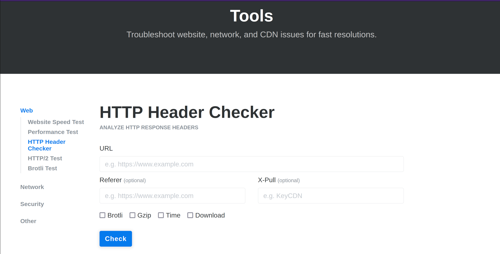
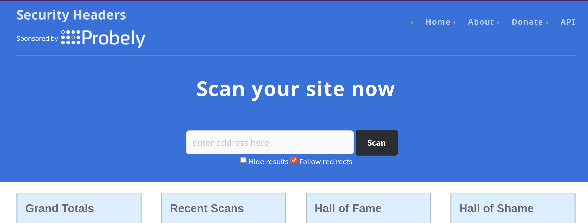

# Check your HTTP security headers

KeyCDN provides an online tool [HTTP Header Checker](https://tools.keycdn.com/curl) that can be used to check which HTTP security headers are set. 

[Security Headers.io](https://securityheaders.io/) gives a website a score based on the available HTTPS headers. The score ranges from A+ to grade F.

